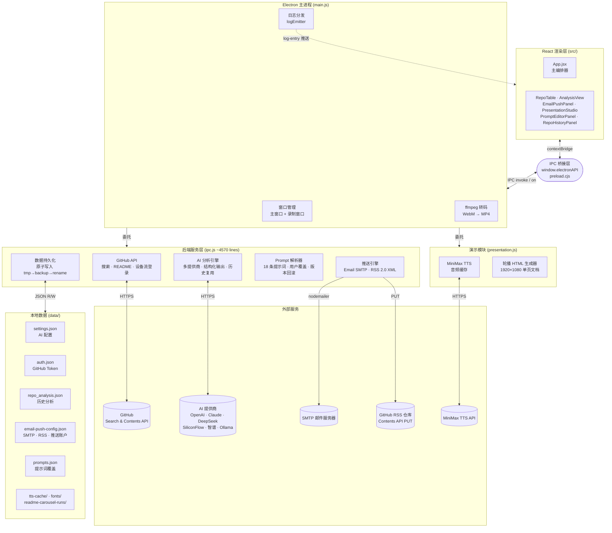

# GitHub Scout

一个基于 Electron + React + Vite 的桌面应用，用来抓取 GitHub 热门/近期仓库，并结合 AI 对结果做标签和摘要分析。

## 功能特性

- 按关键词、日期、Stars、Forks、页数筛选 GitHub 仓库
- 支持 GitHub PAT 登录，提升 API 配额与稳定性
- 支持多家 AI 提供商配置与连接测试
- 当配置了多个可用 AI 时，自动选择**最快检测成功**的提供商进行分析
- 对仓库生成标签、简介和批量总结
- 结合历史分析结果做标签复用与趋势补充
- 支持导出仓库列表为 CSV
- 内置日志面板，可查看抓取、分析、登录、配置日志

## 技术栈

- Electron
- React 19
- Vite 6

## 安装与运行

先安装依赖：

```bash
npm install
```

启动前端开发环境：

```bash
npm run dev
```

启动完整桌面应用：

```bash
npm run electron:dev
```

## 构建

构建前端：

```bash
npm run build
```

构建 Electron Windows 可执行包：

```bash
npm run electron:build
```

构建产物默认输出到：

- `dist/`：前端构建结果
- `release/`：Electron 打包结果

## 使用方式

### 1. 登录 GitHub

应用支持使用 GitHub Personal Access Token 登录。

登录按钮会打开 GitHub Token 创建页，随后将 Token 粘贴回应用中完成验证。

### 2. 配置 AI

在 AI 配置面板中填写对应厂商的：

- Base URL
- API Key
- Model

当前项目内置以下预设：

- OpenAI
- Claude
- SiliconFlow
- DeepSeek
- 智谱
- Ollama
- Custom

### 3. 抓取仓库

可按以下条件筛选：

- 关键词
- 开始/结束日期
- 最小/最大 Stars
- 最小/最大 Forks
- 爬取页数

点击“**一键爬取**”后，应用会通过 GitHub Search API 获取仓库并去重汇总。

### 4. AI 分析

点击“**AI分析**”后，应用会先检测当前已配置的 AI 提供商，并选择最快可用的一个执行分析。

分析结果会输出：

- 仓库标签
- 仓库描述
- 当前批次总结
- 历史趋势补充（如果存在历史记录）

### 5. 导出结果

抓取结果可直接导出为 CSV 文件。

## 项目结构

```text
github-scout/
├─ electron/        # Electron 主进程、IPC、预加载脚本
├─ src/             # React 渲染层
├─ index.html
├─ vite.config.js
├─ electron-builder.json
├─ package.json
└─ 启动.bat
```

## 架构说明

项目分为三层：

1. **Electron 主进程**：创建窗口、注册 IPC、处理桌面行为
2. **Electron 后端服务层**：负责 GitHub API、AI API、登录、持久化、日志分发
3. **React 渲染层**：负责配置界面、仓库列表、分析结果和日志展示

前端通过 `preload.cjs` 暴露的 `window.electronAPI` 与后端通信，不直接访问 Node API。

### 系统架构图



### 核心工作流

```mermaid
flowchart TD
    subgraph Flow1["主流程：仓库搜索 → AI 分析"]
        A([用户设置搜索条件\n关键词 · 日期 · Stars · Forks]) --> B[fetch-repos\nGitHub Search API]
        B --> C[选择仓库\nfetch-selected-readmes]
        C --> D{AI 提供商\n自动竞速检测}
        D -->|最快可用者胜出| E[analyze-repos\n标签 + 描述 + 批次总结]
        E --> F[AnalysisView\nMarkdown 渲染]
        E --> G[(repo_analysis.json\n持久化 + 历史趋势)]
    end

    subgraph Flow2["推送流程：邮件 & RSS"]
        H([配置推送账户\n关键词 · 日期 · 收件人]) --> I[push-email-crawl\nGitHub Search + AI 标签]
        I --> J[EmailPushEditor\n人工审核 & 编辑]
        J --> K{输出渠道}
        K -->|发送邮件| L[nodemailer\nSMTP HTML 邮件]
        K -->|全局 RSS| M[构建 RSS 2.0 XML\nAI 生成每条摘要 20-50 字]
        M --> N{fileMode}
        N -->|dated| O[新建 date.xml\n+ 自动生成 index.html]
        N -->|merge| P[合并去重 by guid\n上限 maxItems 条]
    end

    subgraph Flow3["演示流程：README 轮播视频"]
        Q([PresentationStudio\n选择仓库 + TTS 配置]) --> R[AI 旁白生成\nfinal_prompt.txt]
        R --> S[MiniMax TTS\n每页音频 + 本地缓存]
        S --> T[注入本地图片\n+ base64 字体]
        T --> U[轮播 HTML\n1920×1080 单页/仓库]
        U --> V[屏幕录制\nMediaRecorder WebM]
        V --> W[ffmpeg 转码\nMP4 4K x264 CRF 18\nAAC 320k]
    end
```



## 本地数据说明

应用运行时会在 `data/` 目录写入本地数据，例如：

- AI 配置
- GitHub 登录状态
- 历史仓库分析结果

这些文件属于本地运行数据，不建议提交到仓库。

## 注意事项

- 请不要把个人的 GitHub Token、AI Key 或本地 `data/` 目录内容提交到 GitHub
- 当前 `package.json` 中**没有**测试脚本和 lint 脚本
- 如果你只需要一键启动桌面应用，也可以保留并使用仓库中的 `启动.bat`
